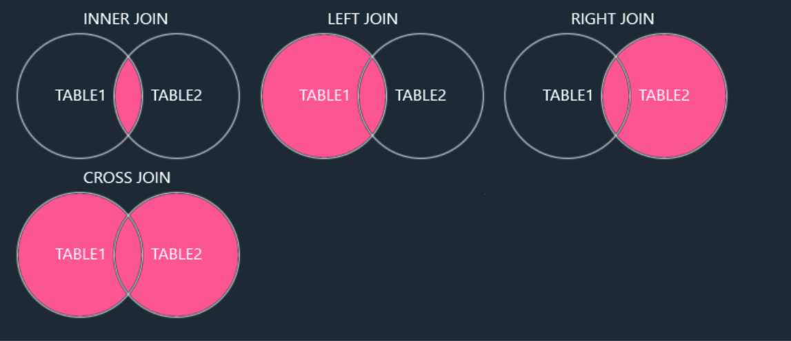

# Databases Class 1
- The traditional way to store data is file storage.
- Databases will give you an organized way to store and retrieve data.
- Example of a database: MySQL, PostgreSQL, SQLite, etc.

## Types of Databases
- Relational Database (RDMS) (Sql)
- No-SQL Database (No-Sql)

## Database Management Systems (DBMS) VS Databases
- Database Management System (DBMS) is a software that manages and stores data.
- Database is a collection of data.

## SQL
- SQL stands for Structured Query Language
- Structured Query Language (SQL) is a language that is used to communicate with databases.
- SQL is kind of like a starndard of databases.

## RDBMS (Relational Database Management System)
- Relational Database Management System (RDBMS) is a software that manages and stores data in a relational database.
- Example of RDBMS: MySQL, PostgreSQL, SQLite, etc.
- All of them depends on SQL standards but they query syntax is different.
- All of them store data in table like format.
- ACID compliance (Atomicity, Consistency, Isolation, Durability).


## NoSQL (Non-Relational Database Management System)
- Example of NoSQL: MongoDB, Redis, etc.
- NoSQL databases are not based on SQL but they are based on different query syntax.
- They don't store data in table like format but they store data in different different formats.
- MongoDB store data in JSON like format.

## MySQL
- Whenever we download any database in local mechine there is a db server like localhost3306
- By requiring this database server we can access any database in local mechine.
- We have to create a mysql databese instance by using the mysql workbench.
- We can write the query in mysql workbench.
- Mysql query is mostly case insensitive but uppercase is preferred.
- Every query should end with semicolon (;).
- We can use VScode entention to  connect to mysql database and write query inside vscode.

### Syntax
- Create a database and comment.
```sql
CREATE DATABASE CLASSDB; -- Create a database in mysql (This is a comment )
```
- Show all the databases and create database if it doesn't exist.
```sql
SHOW DATABASES; -- List all the db in mechine

CREATE DATABASE IF NOT EXISTS CLASSDB;
```

```sql
DROP DATABASE classdb; -- Delete a database
```
```sql
-- Select a database to work
-- After running this query we will work inside this database
USE CLASSDB;
```

```sql
-- Show all the tables in the database
SHOW TABLES;
```
```sql
CREATE TABLE USERS (
    EMAIL VARCHAR(50),
    PASSWORD VARCHAR(50),
    USERNAME VARCHAR(40),
    ID INT PRIMARY KEY AUTO_INCREMENT -- UNIQUE IDENTIFIER -> "PRIMARY KEY", AUTO_INCREMENT -> "IT WILL AUTO INCREMENT INCASE NO VALUE PROVIDED"
); -- This will create a tabele user. This is a skema or blueprint 
```

```sql
DESC USERS; -- This will show the structure of the table
```

```sql
INSERT INTO USERS (EMAIL, PASSWORD, USERNAME) VALUES ("manikmaity@gmail.com", "1234", "Manik Maity");
-- This command insert data to the table columns
```

```sql
SELECT * FROM USERS;
-- This will show all the data in the table
```

```sql
INSERT INTO USERS (EMAIL, PASSWORD, USERNAME) VALUES ("hitam@gmail.com", "123", "Hitam"), ("kiran@gmail.com", "kiran12", "Kiran"), ("subhas@gmail.com", "subhas12", "Shibas"); -- Bulk insert, insert multiple rows togather
```
- Filtering data in select
- There are lot of operators in mysql like ==, >=, <= , AND, OR, NOT, IN, BETWEEN, LIKE, etc.
```sql
SELECT * FROM POST WHERE `USER_ID` = "MANIK2003" AND `CREATED_AT` > "2024-09-01";
```
- LIKE operator is used for searching data based on some pattern.
- %NAME% is used to search for title with name in it.
```SQL
SELECT * FROM POST WHERE `TITLE` LIKE "%NAME%";
SELECT * FROM POST WHERE `BODY` LIKE "%MAITY";
```

```sql
-- Sort data in select query
SELECT * FROM POST ORDER BY CREATED_AT DESC;
```

```SQL
-- This is to delete data.
-- Use condition to delete which data.
DELETE FROM POST WHERE ID = 4;
```

```SQL
UPDATE POST SET `BODY` = "I AM A SELF TOUGHT DEVELOPER" WHERE ID = 7;
```

- In sql database data is stored in rows and columns.
- Every column store one property of data. (Like name, age, address, etc.)
- Rows store one individual record for the property. (Like manik, 21, Kolktata, etc.)
- SQL support datatype to store data.
- Numaric data type: int, float, double, decimal
- String data type: char, varchar, text
- JSON data type: json
- Date and time data type: date, time, datetime


### Note -
- Its not like no-sql are better than sql databases.
- Its not like sql databases are better than no-sql databases.
- Its more like for what purpose you are using the database.


Here’s a breakdown of the five categories of SQL commands, along with example MySQL command snippets for each:

### 1. **DDL – Data Definition Language**
DDL commands are used to define and modify database structures (e.g., tables, schemas).

- **Commands**: `CREATE`, `ALTER`, `DROP`, `TRUNCATE`, `RENAME`

Example (Create a table):
```sql
CREATE TABLE employees (
    id INT PRIMARY KEY AUTO_INCREMENT,
    name VARCHAR(100),
    position VARCHAR(50),
    salary DECIMAL(10, 2)
);
```

Example (Alter a table to add a new column):
```sql
ALTER TABLE employees ADD COLUMN hire_date DATE;
```

### 2. **DQL – Data Query Language**
DQL is used to query and retrieve data from the database.

- **Command**: `SELECT`

Example (Retrieve employee data):
```sql
SELECT name, position, salary FROM employees WHERE salary > 50000;
```

### 3. **DML – Data Manipulation Language**
DML commands are used to insert, update, delete data within the database.

- **Commands**: `INSERT`, `UPDATE`, `DELETE`

Example (Insert a new record):
```sql
INSERT INTO employees (name, position, salary) VALUES ('John Doe', 'Manager', 75000);
```

Example (Update an employee's salary):
```sql
UPDATE employees SET salary = 80000 WHERE name = 'John Doe';
```

Example (Delete an employee record):
```sql
DELETE FROM employees WHERE id = 5;
```

### 4. **DCL – Data Control Language**
DCL commands are used to grant or revoke access permissions on the database.

- **Commands**: `GRANT`, `REVOKE`

Example (Grant permission to a user):
```sql
GRANT SELECT, INSERT ON employees TO 'user'@'localhost';
```

Example (Revoke permission from a user):
```sql
REVOKE INSERT ON employees FROM 'user'@'localhost';
```

### 5. **TCL – Transaction Control Language**
TCL commands are used to manage transactions in a database, ensuring the integrity of the data.

- **Commands**: `COMMIT`, `ROLLBACK`, `SAVEPOINT`

Example (Transaction control):
```sql
START TRANSACTION;

UPDATE employees SET salary = 85000 WHERE id = 3;

COMMIT;  -- Saves the changes
```

Example (Rollback a transaction):
```sql
START TRANSACTION;

UPDATE employees SET salary = 90000 WHERE id = 3;

ROLLBACK;  -- Reverts the update
```

These categories represent the fundamental ways SQL commands are organized to manage database systems.

# Databases Class 2 
- When we have a huge database then we can use pagination to send limited amount of data one time.
- We can `LIMIT` in sql query to send limited amount of data one time.
- `OFSET` is used to specify the starting point.
- This is used pagination.
```sql
SELECT * FROM properties LIMIT 5 OFFSET 2;
-- This will send 5 data from 2nd index
```

### Delete all the records
- Using `DELETE FROM`
```sql
-- This will delete all the comments data.
-- This not the preferred way.
DELETE FROM comments;
```
- Using `TRUNCATE TABLE`
```sql
-- faster way to delete all the data.
-- It internally drops the table and recereates it.
TRUNCATE TABLE COMMENTS;
```

- ENUM type
```sql
CREATE TABLE LIKES (
    id INT PRIMARY KEY AUTO_INCREMENT,
    USER_ID INT,
    CREATED_AT TIMESTAMP DEFAULT CURRENT_TIMESTAMP,
    LIKEABLE_ID INT,
    LIKEABLE_TYPE ENUM("Post", "Comment") -- This will be used so it take the value "Post" or "Comment"
)
```

### Constrains in mySQl
The following constraints are commonly used in SQL:

NOT NULL - Ensures that a column cannot have a NULL value
UNIQUE - Ensures that all values in a column are different
PRIMARY KEY - A combination of a NOT NULL and UNIQUE. Uniquely identifies each row in a table
FOREIGN KEY - Prevents actions that would destroy links between tables
CHECK - Ensures that the values in a column satisfies a specific condition
DEFAULT - Sets a default value for a column if no value is specified
CREATE INDEX - Used to create and retrieve data from the database very quickly

```sql

```

### foreign key
A **foreign key** in MySQL is a constraint that links two tables by referencing a column in one table (the "child" table) to a column in another table (the "parent" table). It ensures that the value in the child table's foreign key column must exist in the parent table's referenced column. 

For example, if the `likes` table has a `USER_ID` column that references the `ID` in the `users` table, it ensures that a like can only be associated with an existing user. If you try to insert a `user_id` in `likes` that doesn’t exist in `users`, MySQL will throw an error.
```sql
CREATE TABLE LIKES (
    id INT PRIMARY KEY AUTO_INCREMENT,
    USER_ID INT,
    CREATED_AT TIMESTAMP DEFAULT CURRENT_TIMESTAMP,
    LIKEABLE_ID INT,
    LIKEABLE_TYPE ENUM("Post", "Comment"),-- This will be used so it take the value "Post" or "Comment"
    FOREIGN KEY (USER_ID) REFERENCES USERS(ID) -- This will check if the user exists
)
```

### JOINS 
- Joins helps combine info from two or more table.
- A JOIN clause is used to combine rows from two or more tables, based on a related column between them.
- No every type of joints supported my every dbms 
```sql
SELECT * FROM likes JOIN users ON likes.USER_ID = users.ID JOIN comments ON comments.`USER_ID` = likes.`USER_ID`;
```

### Types of Joints
- Supported Types of Joins in MySQL
- INNER JOIN: Returns records that have matching values in both tables
- LEFT JOIN: Returns all records from the left table, and the matched records from the right table
- RIGHT JOIN: Returns all records from the right table, and the matched records from the left table
- CROSS JOIN: Returns all records from both tables

;

## Relational

- Meaning of Relational means that it is two tables with a relation between them.
- 1 : 1 Realationship
- 1 : M Realationship
- M : 1 Realationship
- M : M Realationship

### Leetcode database example
- User
```sql
{
    id,
    name,
    username,
    email,
    password
}

- Question
{
    id,
    title,
    description, -- Markdown
    submitted_by, -- refer user.id
    created_at,
    deficulty enum("easy", "medium", "hard"),
    
}

- Question tag
{
    id,
    tag_id,
    question_tag -- refer question.id
}

- Tag table 
{
    id,
    tag_name
}

- Submition 
{
    user_id,
    question_id,
    solved date,
    submition_status enum("correct", "wrong"),
    submited_code,
    forgein key (user_id, question_id)
}

- Likes
{
    user_id,
    question_id,
    likes_at,
    forgein key (user_id, question_id)
}
```