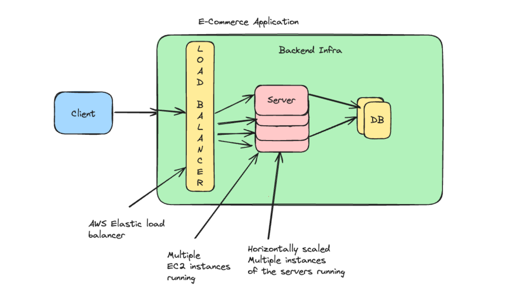

# Architecture ForBackend

- Client  --> Backend Infrastructure
- Server are get the data from backend and send back to client
- Client --> Loadbalancer (AWS Elastic LoadBalancer) --> horizontal scalled server. + database

E-Commerse
- catalog
- payments
- Reviews
- seller

In Devali Sale --> 10M user watch the catalog --> Among them 1M user buy (Payment) --> Among them 100000 give reviews

## MONOLITH ARCHITECTURE - 
In monolith architecture, the whole application backend is in one folder.
Advatages - 1. Easy to maintain. 2. Easy to debug
Example of monolith architecture - Stakeoverflow 

## Microservice Architecture
- In microservice architecture, the whole application backend is in multiple folder.
- One repo for payment, catalog, reviews, seller.
- Avantage - 

1. We can use diff programming language in diffret folder. 
2. Every logical folder is called microservice. 
3. Easy to scale each microservice as much or low we want for change in userbase.
4. Each microservise has its own load balancer.
5. Each microservice may have its own database and maybe all services use one common database. 
6. All services are independent they talk with each other using api and load balancer.

- Disadvantage -
1. Added latency because to intract with each other they will do network call.

## Design Backend Infrastructure of Facebook Messanger/Whatsapp

### Functional Requirement
- 1:1 Chat
- Group Chat
- Support web and mobile
- Only text message support
- Not support E2E
- No video call or image, voice support.
- Strore the chat history
- One message can be of maximum 10^5 character
- Limit on gropup size.
- Online and Offline tag.
- User get message when online.

### Non Functional Requirement (Behavioural)
- Application should be scalable.
- No loss of message.

### Simple example -

- The network communication need to be happen in a reliable way so, we need to use TCP.
- TCP is a connection based protocol and it is used for network communication.
- UCP is a connectionless protocol and it is used for network communication.
- We need to think of a mechanism where recepitient dont have to refresh for each message.
- We can do that using these way:
1. Short polling - In this client again and again ask for message by making request to server.
2. Long polling - In this client ask for message by making long request to server.

### Long polling v/s Short polling
- Long polling is same as short polling but in long polling we wait for a certain time for each message.

## Web Socket 
- WebSocket is different from Socket address (IP + port).
- Web socket is a connection based protocol build on TCP.
- It helps in setup bidirectional persistence connection between two clients.
- In bidirectional connection, whenever the server want server sends message to client without waiting for client to send message.
- To setup websocket we need to send a HTTP request from one mechine to another mechine and another mechine will send an Aknowledgement to the first mechine then HTTP request will updraded to websocket.
- There are now days lot of library for making web socket connenction easily. Ex - Socket.io
- After  websocket connection we can send and recieve message without making any HTTP request.

### What if the client gone offline?
- In that case we we can implement message queue mechanism, so that message can be sent to client when client is back online.
- In message queue mechanism we can store message in queue and send them to client.
- There is diffrent way to implement message queue in JS easily. Ex - RabbitMQ, Kafka.

### Sync vs Async Comunication
- In Sync communication we make a request and wait for response.
- In Async communication we make a request and dont wait for response.